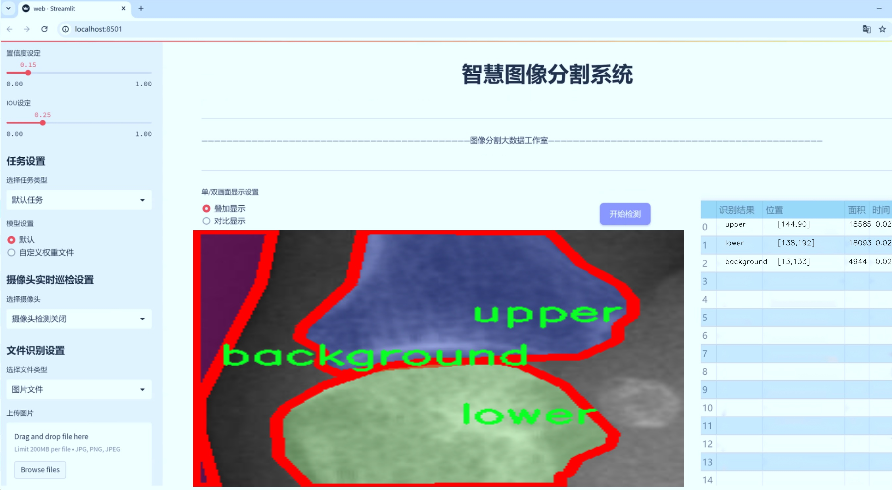
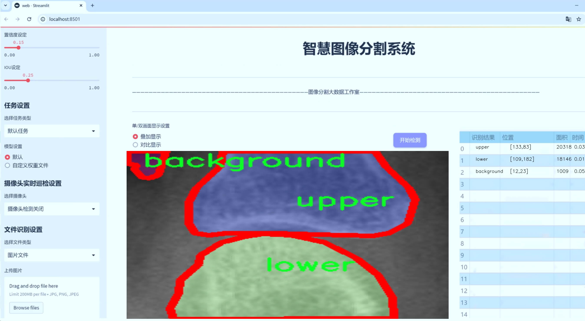
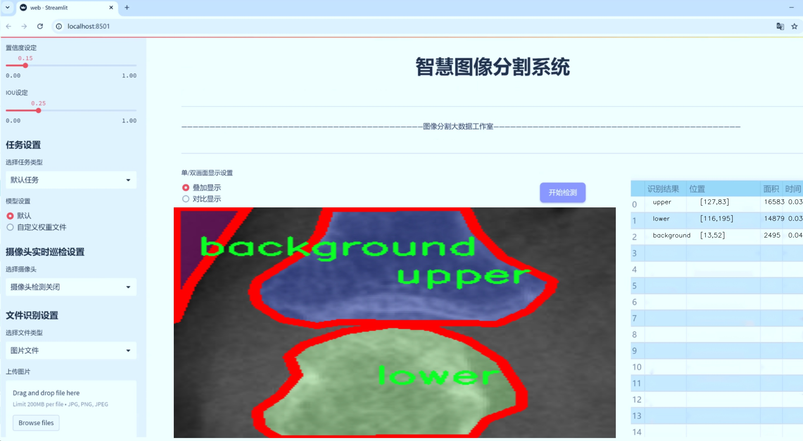
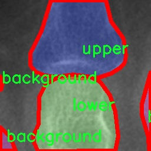
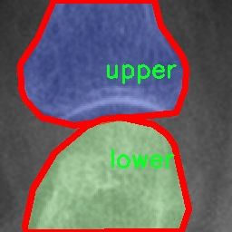
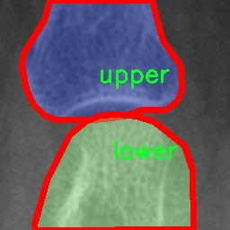
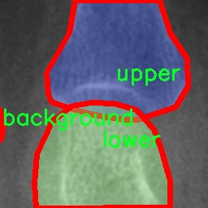
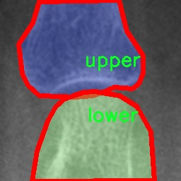

# 手指关节分割系统源码＆数据集分享
 [yolov8-seg-C2f-RFAConv＆yolov8-seg-fasternet-bifpn等50+全套改进创新点发刊_一键训练教程_Web前端展示]

### 1.研究背景与意义

项目参考[ILSVRC ImageNet Large Scale Visual Recognition Challenge](https://gitee.com/YOLOv8_YOLOv11_Segmentation_Studio/projects)

项目来源[AAAI Global Al lnnovation Contest](https://kdocs.cn/l/cszuIiCKVNis)

研究背景与意义

随着计算机视觉技术的迅速发展，深度学习在图像处理领域的应用日益广泛，尤其是在物体检测和分割任务中，取得了显著的成果。手指关节的精确分割在医学影像分析、人体姿态识别以及人机交互等领域具有重要的应用价值。传统的手指关节分割方法往往依赖于手工特征提取和简单的分类器，面临着准确性不足和适应性差等问题。近年来，基于深度学习的实例分割方法，如YOLO（You Only Look Once）系列模型，因其高效性和准确性而受到广泛关注。YOLOv8作为该系列的最新版本，具备了更强的特征提取能力和实时处理能力，为手指关节分割任务提供了新的解决方案。

本研究旨在基于改进的YOLOv8模型，构建一个高效的手指关节分割系统。该系统将专注于对手指关节的下关节和上关节进行精准分割，利用提供的Finger_Select_Joint数据集进行训练和评估。该数据集包含1600张图像，涵盖了三类标注：背景、下关节和上关节。这为模型的训练提供了丰富的样本，有助于提升模型的泛化能力和分割精度。通过对数据集的深入分析，我们可以发现，手指关节的分割不仅需要对图像中的复杂背景进行有效抑制，还需要准确识别不同关节之间的细微差别，这对模型的设计和优化提出了更高的要求。

在研究意义方面，首先，本研究将推动手指关节分割技术的发展，为相关领域的应用提供更为精准的工具。通过对YOLOv8模型的改进，我们期望在分割精度和处理速度上实现突破，满足实时应用的需求。其次，手指关节的精确分割对医学影像分析具有重要意义，能够辅助医生进行疾病诊断和治疗方案的制定。此外，该技术在虚拟现实、增强现实等人机交互场景中也具有广泛的应用前景，可以提升用户体验和交互效果。

最后，本研究还将为深度学习在实例分割领域的进一步探索提供新的思路和方法。通过对YOLOv8模型的改进，我们希望能够为其他类似任务的解决提供借鉴，推动计算机视觉技术的进步。综上所述，基于改进YOLOv8的手指关节分割系统不仅具有重要的理论价值，也具备广泛的实际应用前景，为相关领域的研究和实践提供了新的动力。

### 2.图片演示







##### 注意：由于此博客编辑较早，上面“2.图片演示”和“3.视频演示”展示的系统图片或者视频可能为老版本，新版本在老版本的基础上升级如下：（实际效果以升级的新版本为准）

  （1）适配了YOLOV8的“目标检测”模型和“实例分割”模型，通过加载相应的权重（.pt）文件即可自适应加载模型。

  （2）支持“图片识别”、“视频识别”、“摄像头实时识别”三种识别模式。

  （3）支持“图片识别”、“视频识别”、“摄像头实时识别”三种识别结果保存导出，解决手动导出（容易卡顿出现爆内存）存在的问题，识别完自动保存结果并导出到tempDir中。

  （4）支持Web前端系统中的标题、背景图等自定义修改，后面提供修改教程。

  另外本项目提供训练的数据集和训练教程,暂不提供权重文件（best.pt）,需要您按照教程进行训练后实现图片演示和Web前端界面演示的效果。

### 3.视频演示

[3.1 视频演示](https://www.bilibili.com/video/BV1er1aYNEv4/)

### 4.数据集信息展示

##### 4.1 本项目数据集详细数据（类别数＆类别名）

nc: 3
names: ['background', 'lower', 'upper']


##### 4.2 本项目数据集信息介绍

数据集信息展示

在本研究中，我们采用了名为“Finger_Select_Joint”的数据集，以支持对手指关节的分割任务，旨在改进YOLOv8-seg模型的性能。该数据集专门设计用于手指关节的精确分割，具有丰富的图像样本和多样的场景设置，确保了模型在实际应用中的有效性和鲁棒性。

“Finger_Select_Joint”数据集包含三类主要类别，分别为“background”（背景）、“lower”（下关节）和“upper”（上关节）。这些类别的划分不仅有助于模型在训练过程中学习到不同的特征，还能够提高其在复杂环境下的分割精度。背景类别主要包括手指周围的环境信息，提供了一个相对复杂的背景，以增强模型对背景干扰的适应能力。下关节和上关节则分别对应手指的不同部分，模型需要能够准确地区分这两部分，以实现精确的关节分割。

数据集中的图像样本涵盖了多种手指姿势和不同的光照条件，确保了数据的多样性和代表性。这种多样性不仅提高了模型的泛化能力，还使得其在面对不同用户和不同场景时能够保持良好的性能。此外，数据集中还包含了大量的标注信息，确保每个类别的像素级别标注准确无误，为模型的训练提供了坚实的基础。

在数据集的构建过程中，研究团队特别关注了数据的质量和标注的一致性。通过严格的标注流程和多轮审核，确保了每个样本的标注信息都能够反映出真实的手指关节结构。这种高质量的标注数据对于深度学习模型的训练至关重要，因为模型的性能往往直接受到训练数据质量的影响。

为了进一步增强模型的学习能力，数据集还应用了数据增强技术，包括旋转、缩放、翻转等多种变换。这些增强方法不仅丰富了训练样本的多样性，还有效地提高了模型的鲁棒性，使其能够在面对不同的输入时保持稳定的性能表现。

总之，“Finger_Select_Joint”数据集为手指关节分割任务提供了一个高质量、丰富多样的训练基础。通过对该数据集的深入分析和应用，我们期望能够显著提升YOLOv8-seg模型在手指关节分割任务中的表现，推动相关领域的研究进展。随着技术的不断发展和数据集的持续优化，我们相信这一数据集将为未来的研究提供更多的可能性和应用前景。











### 5.全套项目环境部署视频教程（零基础手把手教学）

[5.1 环境部署教程链接（零基础手把手教学）](https://www.bilibili.com/video/BV1jG4Ve4E9t/?vd_source=bc9aec86d164b67a7004b996143742dc)


[5.2 安装Python虚拟环境创建和依赖库安装视频教程链接（零基础手把手教学）](https://www.bilibili.com/video/BV1nA4VeYEze/?vd_source=bc9aec86d164b67a7004b996143742dc)

### 6.手把手YOLOV8-seg训练视频教程（零基础小白有手就能学会）

[6.1 手把手YOLOV8-seg训练视频教程（零基础小白有手就能学会）](https://www.bilibili.com/video/BV1cA4VeYETe/?vd_source=bc9aec86d164b67a7004b996143742dc)


按照上面的训练视频教程链接加载项目提供的数据集，运行train.py即可开始训练



     Epoch   gpu_mem       box       obj       cls    labels  img_size
     1/200     0G   0.01576   0.01955  0.007536        22      1280: 100%|██████████| 849/849 [14:42<00:00,  1.04s/it]
               Class     Images     Labels          P          R     mAP@.5 mAP@.5:.95: 100%|██████████| 213/213 [01:14<00:00,  2.87it/s]
                 all       3395      17314      0.994      0.957      0.0957      0.0843

     Epoch   gpu_mem       box       obj       cls    labels  img_size
     2/200     0G   0.01578   0.01923  0.007006        22      1280: 100%|██████████| 849/849 [14:44<00:00,  1.04s/it]
               Class     Images     Labels          P          R     mAP@.5 mAP@.5:.95: 100%|██████████| 213/213 [01:12<00:00,  2.95it/s]
                 all       3395      17314      0.996      0.956      0.0957      0.0845

     Epoch   gpu_mem       box       obj       cls    labels  img_size
     3/200     0G   0.01561    0.0191  0.006895        27      1280: 100%|██████████| 849/849 [10:56<00:00,  1.29it/s]
               Class     Images     Labels          P          R     mAP@.5 mAP@.5:.95: 100%|███████   | 187/213 [00:52<00:00,  4.04it/s]
                 all       3395      17314      0.996      0.957      0.0957      0.0845


### 7.50+种全套YOLOV8-seg创新点代码加载调参视频教程（一键加载写好的改进模型的配置文件）

[7.1 50+种全套YOLOV8-seg创新点代码加载调参视频教程（一键加载写好的改进模型的配置文件）](https://www.bilibili.com/video/BV1Hw4VePEXv/?vd_source=bc9aec86d164b67a7004b996143742dc)

### 8.YOLOV8-seg图像分割算法原理

原始YOLOv8-seg算法原理

YOLOv8-seg算法是YOLO系列中的最新版本，专注于目标检测与分割任务，结合了高效的特征提取和精确的目标定位能力。该算法在YOLOv8的基础上进行了进一步的改进，旨在提升模型在复杂场景下的表现，尤其是在物体边界的精确分割上。YOLOv8-seg不仅延续了YOLO系列一贯的高效性和实时性，还引入了新的网络结构和训练策略，使其在处理多种视觉任务时表现得更加出色。

YOLOv8-seg的网络结构依然由Backbone、Neck和Head三部分组成，但在细节上进行了显著的优化。Backbone部分采用了CSPDarknet结构，结合了残差块的设计，旨在提取输入图像中的深层特征。CSPDarknet的创新之处在于其跨阶段部分的设计，使得特征图在多个分支中进行处理，增强了模型对特征的学习能力。具体而言，YOLOv8-seg使用了C2f模块来替代传统的C3模块，这一变更不仅提升了特征图的维度，还通过分支的堆叠增加了网络的表达能力。每个分支经过卷积层的处理后，输出的特征图被融合，形成更为丰富的特征表示，这为后续的目标检测和分割提供了坚实的基础。

在Neck部分，YOLOv8-seg采用了特征金字塔网络（FPN）和路径聚合网络（PAN）的组合，旨在有效整合来自不同层次的特征信息。FPN通过自上而下的方式传递高层语义信息，而PAN则通过自下而上的方式增强低层特征的语义信息。这种双向的信息流动使得模型能够更好地捕捉到目标的细节特征，尤其是在处理小物体或复杂背景时，能够显著提高分割的精度。

Head部分是YOLOv8-seg的核心，采用了解耦头的设计理念。与传统的目标检测模型不同，YOLOv8-seg将分类和定位任务分开处理，分别通过两个并行的分支进行特征提取。这种设计使得模型在处理不同任务时能够更好地专注于各自的目标，从而提高了收敛速度和预测精度。特别是在目标分割任务中，模型能够更精确地识别物体的边界，并对每个像素进行分类，从而实现精细的分割效果。

YOLOv8-seg的另一个重要创新是引入了无锚框（Anchor-Free）检测机制。这一机制直接预测目标的中心点和宽高比例，避免了传统锚框方法中对锚框设计和选择的依赖。这种方法不仅简化了模型的设计，还提高了检测速度和准确度。通过无锚框的设计，YOLOv8-seg能够更灵活地适应不同形状和大小的目标，尤其是在复杂场景中，表现得更加优越。

在训练过程中，YOLOv8-seg还采用了任务对齐学习（Task Alignment Learning, TAL）策略，以优化分类和定位的性能。通过引入分类分数和IOU的高次幂乘积作为衡量指标，模型能够在训练时更好地平衡分类和定位的损失，从而实现更高的检测精度和更快的收敛速度。这一策略的引入使得YOLOv8-seg在面对多样化的目标时，能够保持较高的准确性和鲁棒性。

此外，YOLOv8-seg在数据增强方面也进行了优化。虽然Mosaic数据增强在一定程度上提升了模型的鲁棒性，但过度使用可能会导致模型学习到不良信息。因此，YOLOv8-seg在训练的最后阶段停止使用Mosaic增强，以确保模型能够更好地学习到真实数据的分布特征。这一策略的调整，进一步提升了模型在实际应用中的表现。

综上所述，YOLOv8-seg算法通过一系列创新的设计和策略，成功地将目标检测与分割任务结合在一起，展现出卓越的性能。其高效的特征提取、灵活的无锚框检测机制、解耦头的设计以及优化的数据增强策略，使得YOLOv8-seg在复杂视觉任务中具备了更强的适应性和准确性。这些特性使得YOLOv8-seg不仅在学术研究中具有重要的价值，也在实际应用中展现出广泛的前景，尤其是在自动驾驶、智能监控和机器人视觉等领域。随着YOLOv8-seg的不断发展和完善，未来其在更多应用场景中的潜力将会被进一步挖掘。


### 9.系统功能展示（检测对象为举例，实际内容以本项目数据集为准）

图9.1.系统支持检测结果表格显示

  图9.2.系统支持置信度和IOU阈值手动调节

  图9.3.系统支持自定义加载权重文件best.pt(需要你通过步骤5中训练获得)

  图9.4.系统支持摄像头实时识别

  图9.5.系统支持图片识别

  图9.6.系统支持视频识别

  图9.7.系统支持识别结果文件自动保存

  图9.8.系统支持Excel导出检测结果数据


### 10.50+种全套YOLOV8-seg创新点原理讲解（非科班也可以轻松写刊发刊，V11版本正在科研待更新）

#### 10.1 由于篇幅限制，每个创新点的具体原理讲解就不一一展开，具体见下列网址中的创新点对应子项目的技术原理博客网址【Blog】：


[10.1 50+种全套YOLOV8-seg创新点原理讲解链接](https://gitee.com/qunmasj/good)

#### 10.2 部分改进模块原理讲解(完整的改进原理见上图和技术博客链接)【如果此小节的图加载失败可以通过CSDN或者Github搜索该博客的标题访问原始博客，原始博客图片显示正常】
### 深度学习基础
卷积神经网络通过使用具有共享参数的卷积运算显著降低了模型的计算开销和复杂性。在LeNet、AlexNet和VGG等经典网络的驱动下，卷积神经网络现在已经建立了一个完整的系统，并在深度学习领域形成了先进的卷积神经网络模型。

感受野注意力卷积RFCBAMConv的作者在仔细研究了卷积运算之后获得了灵感。对于分类、目标检测和语义分割任务，一方面，图像中不同位置的对象的形状、大小、颜色和分布是可变的。在卷积操作期间，卷积核在每个感受野中使用相同的参数来提取信息，而不考虑来自不同位置的差分信息。这限制了网络的性能，这已经在最近的许多工作中得到了证实。

另一方面，卷积运算没有考虑每个特征的重要性，这进一步影响了提取特征的有效性，并最终限制了模型的性能。此外，注意力机制允许模型专注于重要特征，这可以增强特征提取的优势和卷积神经网络捕获详细特征信息的能力。因此，注意力机制在深度学习中得到了广泛的应用，并成功地应用于各个领域。

通过研究卷积运算的内在缺陷和注意力机制的特点，作者认为现有的空间注意力机制从本质上解决了卷积运算的参数共享问题，但仍局限于对空间特征的认知。对于较大的卷积核，现有的空间注意力机制并没有完全解决共享参数的问题。此外，他们无法强调感受野中每个特征的重要性，例如现有的卷积块注意力模块（CBAM）和 Coordinate注意力（CA）。

因此，[参考该博客提出了一种新的感受野注意力机制（RFA）](https://qunmasj.com)，它完全解决了卷积核共享参数的问题，并充分考虑了感受野中每个特征的重要性。通过RFA设计的卷积运算（RFAConv）是一种新的卷积运算，可以取代现有神经网络中的标准卷积运算。RFAConv通过添加一些参数和计算开销来提高网络性能。

大量关于Imagnet-1k、MS COCO和VOC的实验已经证明了RFAConv的有效性。作为一种由注意力构建的新型卷积运算，它超过了由CAM、CBAM和CA构建的卷积运算（CAMConv、CBAMConv、CAConv）以及标准卷积运算。

此外，为了解决现有方法提取感受野特征速度慢的问题，提出了一种轻量级操作。在构建RFAConv的过程中，再次设计了CA和CBAM的升级版本，并进行了相关实验。作者认为当前的空间注意力机制应该将注意力放在感受野空间特征上，以促进当前空间注意力机制的发展，并再次增强卷积神经网络架构的优势。


### 卷积神经网络架构
出色的神经网络架构可以提高不同任务的性能。卷积运算作为卷积神经网络的一种基本运算，推动了人工智能的发展，并为车辆检测、无人机图像、医学等先进的网络模型做出了贡献。He等人认为随着网络深度的增加，该模型将变得难以训练并产生退化现象，因此他们提出了残差连接来创新卷积神经网络架构的设计。Huang等人通过重用特征来解决网络梯度消失问题，增强了特征信息，他们再次创新了卷积神经网络架构。

通过对卷积运算的详细研究，Dai等人认为，具有固定采样位置的卷积运算在一定程度上限制了网络的性能，因此提出了Deformable Conv，通过学习偏移来改变卷积核的采样位置。在Deformable Conv的基础上，再次提出了Deformable Conv V2和Deformable Conv V3，以提高卷积网络的性能。

Zhang等人注意到，组卷积可以减少模型的参数数量和计算开销。然而，少于组内信息的交互将影响最终的网络性能。1×1的卷积可以与信息相互作用。然而，这将带来更多的参数和计算开销，因此他们提出了无参数的“通道Shuffle”操作来与组之间的信息交互。

Ma等人通过实验得出结论，对于参数较少的模型，推理速度不一定更快，对于计算量较小的模型，推理也不一定更快。经过仔细研究提出了Shufflenet V2。

YOLO将输入图像划分为网格，以预测对象的位置和类别。经过不断的研究，已经提出了8个版本的基于YOLO的目标检测器，如YOLOv5、YOLOv7、YOLOv8等。上述卷积神经网络架构已经取得了巨大的成功。然而，它们并没有解决提取特征过程中的参数共享问题。本文的工作从注意力机制开始，从一个新的角度解决卷积参数共享问题。

### 注意力机制
注意力机制被用作一种提高网络模型性能的技术，使其能够专注于关键特性。注意力机制理论已经在深度学习中建立了一个完整而成熟的体系。Hu等人提出了一种Squeeze-and-Excitation（SE）块，通过压缩特征来聚合全局通道信息，从而获得与每个通道对应的权重。Wang等人认为，当SE与信息交互时，单个通道和权重之间的对应关系是间接的，因此设计了高效通道注Efficient Channel Attention力（ECA），并用自适应kernel大小的一维卷积取代了SE中的全连接（FC）层。Woo等人提出了卷积块注意力模块（CBAM），它结合了通道注意力和空间注意力。作为一个即插即用模块，它可以嵌入卷积神经网络中，以提高网络性能。

尽管SE和CBAM已经提高了网络的性能。Hou等人仍然发现压缩特征在SE和CBAM中丢失了太多信息。因此，他们提出了轻量级Coordinate注意力（CA）来解决SE和CBAM中的问题。Fu等人计了一个空间注意力模块和通道注意力模块，用于扩展全卷积网络（FCN），分别对空间维度和通道维度的语义相关性进行建模。Zhang等人在通道上生成不同尺度的特征图，以建立更有效的通道注意力机制。

本文从一个新的角度解决了标准卷积运算的参数共享问题。这就是将注意力机制结合起来构造卷积运算。尽管目前的注意力机制已经获得了良好的性能，但它们仍然没有关注感受野的空间特征。因此，设计了具有非共享参数的RFA卷积运算，以提高网络的性能。


#### 回顾标准卷积
以标准卷积运算为基础构建卷积神经网络，通过共享参数的滑动窗口提取特征信息，解决了全连接层构建的神经网络的固有问题（即参数数量大、计算开销高）。

设表示输入特征图，其中、和分别表示特征图的通道数、高度和宽度。为了能够清楚地展示卷积核提取特征信息的过程，以为例。提取每个感受野slider的特征信息的卷积运算可以表示如下：


这里，表示在每次卷积slider操作之后获得的值，表示在每个slider内的相应位置处的像素值。表示卷积核，表示卷积核中的参数数量，表示感受野slider的总数。

可以看出，每个slider内相同位置的特征共享相同的参数。因此，标准的卷积运算无法感知不同位置带来的差异信息，这在一定程度上限制了卷积神经网络的性能。

#### 回顾空间注意力
目前，空间注意力机制使用通过学习获得的注意力图来突出每个特征的重要性。与上一节类似，以为例。突出关键特征的空间注意力机制可以简单地表达如下：


这里，表示在加权运算之后获得的值。和分别表示输入特征图和学习注意力图在不同位置的值，是输入特征图的高度和宽度的乘积，表示像素值的总数。一般来说，整个过程可以简单地表示在图1中。


#### 空间注意力与标准卷积
众所周知，将注意力机制引入卷积神经网络可以提高网络的性能。通过标准的卷积运算和对现有空间注意力机制的仔细分析。作者认为空间注意力机制本质上解决了卷积神经网络的固有缺点，即共享参数的问题。

目前，该模型最常见的卷积核大小为1×1和3×3。引入空间注意力机制后用于提取特征的卷积操作是1×1或3×3卷积操作。这个过程可以直观地显示出来。空间注意力机制被插入到1×1卷积运算的前面。通过注意力图对输入特征图进行加权运算（Re-weight“×”），最后通过1×1卷积运算提取感受野的slider特征信息。

整个过程可以简单地表示如下：


 

这里，卷积核仅表示一个参数值。如果将的值作为一个新的卷积核参数，那么有趣的是，通过1×1卷积运算提取特征时的参数共享问题得到了解决。然而，空间注意力机制的传说到此结束。当空间注意力机制被插入到3×3卷积运算的前面时。具体情况如下：


如上所述，如果取的值。作为一种新的卷积核参数，上述方程完全解决了大规模卷积核的参数共享问题。然而，最重要的一点是，卷积核在每个感受野slider中提取将共享部分特征的特征。换句话说，在每个感受野slider内都会有重叠。

经过仔细分析发现，，…，空间注意力图的权重在每个slider内共享。因此，空间注意机制不能解决大规模卷积核共享参数的问题，因为它们不注意感受野的空间特征。在这种情况下，空间注意力机制是有限的。
#### 创新空间注意力与标准卷积
RFA是为了解决空间注意力机制问题而提出的，创新了空间注意力。使用与RFA相同的思想，一系列空间注意力机制可以再次提高性能。RFA设计的卷积运算可以被视为一种轻量级的即插即用模块，以取代标准卷积，从而提高卷积神经网络的性能。因此，作者认为空间注意力机制和标准卷积在未来将有一个新的春天。

感受野的空间特征：

现在给出感受野空间特征的定义。它是专门为卷积核设计的，并根据kernel大小动态生成，如图2所示，以3×3卷积核为例。


在图2中，“空间特征”表示原始特征图，等于空间特征。“感受野空间特征”表示变换后的特征，该特征由每个感受野slider滑块组成，并且不重叠。也就是说，“感受野空间特征”中的每个3×3大小的slider表示提取原始3×3卷积特征时所有感觉野slider的特征。

#### 感受野注意力卷积(RFA):

关于感受野空间特征，该博客的作者提出了感受野注意（RFA），它不仅强调了感受野slider内各种特征的重要性，而且还关注感受野空间特性，以彻底解决卷积核参数共享的问题。感受野空间特征是根据卷积核的大小动态生成的，因此，RFA是卷积的固定组合，不能脱离卷积运算的帮助，卷积运算同时依赖RFA来提高性能。

因此，作者提出了感受野注意力卷积（RFAConv）。具有3×3大小卷积核的RFAConv的总体结构如图3所示。


目前，提取感受野特征最常用的方法速度较慢，因此经过不断探索提出了一种快速的方法，通过分组卷积来取代原来的方法。

具体来说，根据感受野大小，使用相应的组卷积大小来动态生成展开特征。尽管与原始的无参数方法（如Pytorch提供的nn.Unfld()）相比，该方法添加了一些参数，但速度要快得多。

注意：正如在上一节中提到的，当原始的3×3卷积核提取特征时，感受野空间特征中的每个3×3大小的窗口表示所有感受野滑块的特征。但在快速分组卷积提取感受野特征后，由于原始方法太慢，它们会被映射到新的特征中。

最近的一些工作已经证明信息交互可以提高网络性能。类似地，对于RFAConv，与感受野特征信息交互以学习注意力图可以提高网络性能，但与每个感受野特征交互将带来额外的计算开销。为了确保少量的计算开销和参数数量，通过探索使用AvgPool池化每个感受野特征的全局信息，然后通过1×1组卷积运算与信息交互。最后，softmax用于强调感受野特征中每个特征的重要性。通常，RFA的计算可以表示为：


表示分组卷积，表示卷积核的大小，代表规范化，表示输入特征图，是通过将注意力图与变换的感受野空间特征相乘而获得的。

与CBAM和CA不同，RFA可以为每个感受野特征生成注意力图。标准卷积受到卷积神经网络性能的限制，因为共享参数的卷积运算对位置带来的差异信息不敏感。RFA完全可以解决这个问题，具体细节如下：


由于RFA获得的特征图是“调整形状”后不重叠的感受野空间特征，因此通过池化每个感受野滑块的特征信息来学习学习的注意力图。换句话说，RFA学习的注意力图不再在每个感受野slider内共享，并且是有效的。这完全解决了现有的CA和CBAM对大尺寸kernel的注意力机制中的参数共享问题。

同时，RFA给标准卷积核带来了相当大的好处，但调整形状后，特征的高度和宽度是k倍，需要进行k×k的stride卷积运算，才能提取特征信息。RFAConv创新了标准卷积运算。

此外，空间注意力机制将得到升级，因为作者认为现有的空间注意力机制应该专注于感受野空间特征，以提高网络的性能。众所周知，基于自注意力机制的网络模型取得了巨大的成功，因为它解决了卷积参数共享的问题，并对远程信息进行了建模，但基于自注意力机理的方法给模型带来了巨大的计算开销和复杂性。作者认为通过将一些现有空间注意力机制的注意力放在感受野空间特征中，它以轻量级的方式解决了自注意力机制的问题。

答案如下：

将关注感受野空间特征的空间注意力与卷积相匹配，完全解决了卷积参数共享的问题；

当前的空间注意力机制本身具有考虑远距离信息的特点，它们通过全局平均池化或全局最大池化来获得全局信息，这在一定程度上考虑了远距离信息。


为此，作者设计了一种新的CBAM和CA，称为RFACBAM和RFACA，它专注于感受野的空间特征。与RFA类似，使用stride为k的k×k的最终卷积运算来提取特征信息，具体结构如图4和图5所示，将这2种新的卷积方法称为RFCBAMConv和RFCAConv。比较原始的CBAM，使用SE注意力来代替RFCBAM中的CAM。因为这样可以减少计算开销。


此外，在RFCBAM中，通道和空间注意力不是在单独的步骤中执行的，因为通道和空间注意力是同时加权的，从而允许在每个通道上获得的注意力图是不同的。


### 11.项目核心源码讲解（再也不用担心看不懂代码逻辑）

#### 11.1 ultralytics\nn\modules\utils.py

以下是对代码的核心部分进行提炼和详细注释的结果：

```python
import torch
import torch.nn.functional as F

def multi_scale_deformable_attn_pytorch(value: torch.Tensor, value_spatial_shapes: torch.Tensor,
                                        sampling_locations: torch.Tensor,
                                        attention_weights: torch.Tensor) -> torch.Tensor:
    """
    多尺度可变形注意力机制。

    参数:
        value: 输入特征图，形状为 (bs, C, num_heads, embed_dims)，
               其中 bs 是批量大小，C 是通道数，num_heads 是头数，embed_dims 是每个头的维度。
        value_spatial_shapes: 特征图的空间形状，形状为 (num_levels, 2)，
                              每一行代表一个特征图的高度和宽度。
        sampling_locations: 采样位置，形状为 (bs, num_queries, num_heads, num_levels, num_points, 2)，
                           其中 num_queries 是查询的数量，num_levels 是特征图的层数，num_points 是每层的采样点数。
        attention_weights: 注意力权重，形状为 (bs, num_heads, num_queries, num_levels, num_points)。

    返回:
        output: 经过多尺度可变形注意力机制处理后的输出，形状为 (bs, num_queries, num_heads * embed_dims)。
    """

    # 获取输入的形状信息
    bs, _, num_heads, embed_dims = value.shape  # bs: 批量大小, num_heads: 头数, embed_dims: 嵌入维度
    _, num_queries, _, num_levels, num_points, _ = sampling_locations.shape  # num_queries: 查询数量

    # 将输入特征图根据空间形状拆分为多个特征图
    value_list = value.split([H_ * W_ for H_, W_ in value_spatial_shapes], dim=1)

    # 将采样位置转换为[-1, 1]范围
    sampling_grids = 2 * sampling_locations - 1
    sampling_value_list = []

    # 遍历每个特征图层
    for level, (H_, W_) in enumerate(value_spatial_shapes):
        # 将特征图进行变形和转置，以便进行采样
        value_l_ = (value_list[level].flatten(2).transpose(1, 2).reshape(bs * num_heads, embed_dims, H_, W_))

        # 获取当前层的采样网格
        sampling_grid_l_ = sampling_grids[:, :, :, level].transpose(1, 2).flatten(0, 1)

        # 使用grid_sample进行双线性插值采样
        sampling_value_l_ = F.grid_sample(value_l_,
                                          sampling_grid_l_,
                                          mode='bilinear',
                                          padding_mode='zeros',
                                          align_corners=False)
        sampling_value_list.append(sampling_value_l_)

    # 处理注意力权重的形状
    attention_weights = attention_weights.transpose(1, 2).reshape(bs * num_heads, 1, num_queries,
                                                                  num_levels * num_points)

    # 计算最终输出
    output = ((torch.stack(sampling_value_list, dim=-2).flatten(-2) * attention_weights).sum(-1).view(
        bs, num_heads * embed_dims, num_queries))

    return output.transpose(1, 2).contiguous()  # 返回形状为 (bs, num_queries, num_heads * embed_dims) 的输出
```

### 代码分析
1. **多尺度可变形注意力机制**：该函数实现了多尺度可变形注意力机制，主要用于处理特征图中的信息，增强模型对不同尺度特征的捕捉能力。
2. **输入参数**：
   - `value`：输入特征图，包含多个头的特征表示。
   - `value_spatial_shapes`：特征图的空间形状，帮助在不同层中进行特征分割。
   - `sampling_locations`：指定在特征图上进行采样的位置。
   - `attention_weights`：注意力权重，用于加权不同层的采样结果。
3. **输出**：经过多尺度可变形注意力机制处理后的特征，形状为 `(bs, num_queries, num_heads * embed_dims)`，可用于后续的任务，如目标检测或图像分割。

### 关键步骤
- **特征图拆分**：根据空间形状将输入特征图拆分为多个小特征图，以便进行多尺度处理。
- **采样位置转换**：将采样位置从 `[0, 1]` 范围转换为 `[-1, 1]` 范围，以适应 `grid_sample` 函数的要求。
- **双线性插值采样**：使用 `grid_sample` 函数从特征图中根据采样位置进行插值采样。
- **加权求和**：根据注意力权重对采样结果进行加权求和，得到最终的输出特征。

这个文件是Ultralytics YOLO项目中的一个工具模块，主要包含了一些用于深度学习模型的实用函数和类。文件的开头部分包含了版权信息和模块说明。接下来，文件导入了一些必要的库，包括`copy`、`math`、`numpy`和`torch`等，这些库为后续的函数实现提供了基础。

文件中定义了几个重要的函数。首先是`_get_clones(module, n)`，这个函数用于创建一个给定模块的克隆列表，返回一个`nn.ModuleList`对象，其中包含了`n`个深拷贝的模块。这在构建深度学习模型时非常有用，尤其是在需要多个相同层的情况下。

接下来是`bias_init_with_prob(prior_prob=0.01)`，这个函数根据给定的概率值初始化卷积或全连接层的偏置值。具体来说，它使用了对数几率的计算方法，将概率转换为偏置值，返回计算得到的偏置初始化值。

`linear_init_(module)`函数用于初始化线性模块的权重和偏置。它根据模块的权重形状计算一个边界值，并使用均匀分布在这个边界范围内初始化权重和偏置。这种初始化方法有助于提高模型的训练效果。

`inverse_sigmoid(x, eps=1e-5)`函数计算输入张量的反sigmoid函数。它首先将输入值限制在0到1之间，然后通过对数运算计算反sigmoid值。这个函数在某些情况下可以用于梯度计算或损失函数的设计。

最后，`multi_scale_deformable_attn_pytorch`函数实现了多尺度可变形注意力机制。该函数接收多个输入参数，包括值张量、空间形状、采样位置和注意力权重。它首先对输入进行形状分解和转换，然后通过`F.grid_sample`函数进行采样，得到不同尺度下的特征表示。最后，函数将这些采样值与注意力权重结合，输出最终的注意力结果。

总体而言，这个文件提供了一些深度学习模型中常用的工具函数，特别是在实现复杂的注意力机制时非常重要。这些函数的设计考虑了模块的重用性和初始化策略，有助于提高模型的性能和训练效率。

#### 11.2 ultralytics\models\nas\predict.py

以下是经过简化和注释的核心代码部分：

```python
import torch
from ultralytics.engine.predictor import BasePredictor
from ultralytics.engine.results import Results
from ultralytics.utils import ops

class NASPredictor(BasePredictor):
    """
    Ultralytics YOLO NAS 预测器，用于目标检测。

    该类扩展了 Ultralytics 引擎中的 `BasePredictor`，负责对 YOLO NAS 模型生成的原始预测结果进行后处理。
    它应用了非极大值抑制（NMS）和将边界框缩放到原始图像尺寸等操作。

    属性:
        args (Namespace): 包含各种后处理配置的命名空间。
    """

    def postprocess(self, preds_in, img, orig_imgs):
        """对预测结果进行后处理，并返回结果对象的列表。"""

        # 将预测框转换为 (x_center, y_center, width, height) 格式
        boxes = ops.xyxy2xywh(preds_in[0][0])
        
        # 合并边界框和类分数，并调整维度
        preds = torch.cat((boxes, preds_in[0][1]), -1).permute(0, 2, 1)

        # 应用非极大值抑制，过滤掉重叠的边界框
        preds = ops.non_max_suppression(preds,
                                        self.args.conf,  # 置信度阈值
                                        self.args.iou,   # IOU 阈值
                                        agnostic=self.args.agnostic_nms,  # 是否对类别无关
                                        max_det=self.args.max_det,  # 最大检测数量
                                        classes=self.args.classes)  # 指定的类别

        # 如果输入图像不是列表，则将其转换为 NumPy 数组
        if not isinstance(orig_imgs, list):
            orig_imgs = ops.convert_torch2numpy_batch(orig_imgs)

        results = []
        # 遍历每个预测结果
        for i, pred in enumerate(preds):
            orig_img = orig_imgs[i]  # 获取原始图像
            # 将边界框缩放到原始图像的尺寸
            pred[:, :4] = ops.scale_boxes(img.shape[2:], pred[:, :4], orig_img.shape)
            img_path = self.batch[0][i]  # 获取图像路径
            # 创建结果对象并添加到结果列表中
            results.append(Results(orig_img, path=img_path, names=self.model.names, boxes=pred))
        
        return results  # 返回处理后的结果列表
```

### 代码说明：
1. **类定义**：`NASPredictor` 继承自 `BasePredictor`，用于处理 YOLO NAS 模型的预测结果。
2. **postprocess 方法**：该方法负责对模型的原始预测结果进行后处理，包括：
   - 将预测框格式转换为中心点和宽高格式。
   - 合并边界框和类别分数，并进行维度调整。
   - 应用非极大值抑制（NMS）来过滤掉重叠的边界框。
   - 将输入图像转换为 NumPy 数组（如果不是列表）。
   - 遍历每个预测结果，缩放边界框到原始图像的尺寸，并创建结果对象。
3. **返回结果**：最终返回处理后的结果列表，包含每个图像的预测信息。

这个程序文件是Ultralytics YOLO（You Only Look Once）模型的一部分，专门用于对象检测的预测后处理。它定义了一个名为`NASPredictor`的类，该类继承自`BasePredictor`，并负责处理YOLO NAS模型生成的原始预测结果。

在类的文档字符串中，说明了该类的功能和用途。`NASPredictor`类的主要任务是对模型的原始预测结果进行后处理，包括应用非极大值抑制（Non-Maximum Suppression, NMS）和将边界框缩放到原始图像的尺寸。

该类的属性`args`是一个命名空间，包含了后处理所需的各种配置参数。示例代码展示了如何使用这个预测器，首先从Ultralytics库中导入`NAS`模型，然后创建模型实例和预测器，最后调用`postprocess`方法来处理原始预测结果。

`postprocess`方法是该类的核心功能。它接收三个参数：`preds_in`（原始预测结果）、`img`（输入图像）和`orig_imgs`（原始图像）。在方法内部，首先将预测框的坐标从xyxy格式转换为xywh格式，并将边界框和类分数合并。接着，调用`non_max_suppression`函数对预测结果进行非极大值抑制，以消除冗余的检测框。

接下来，方法检查输入的原始图像是否为列表格式，如果不是，则将其转换为NumPy数组。然后，方法遍历每个预测结果，缩放边界框以适应原始图像的尺寸，并将结果存储在`Results`对象中。最后，返回一个包含所有结果的列表。

总的来说，这个文件实现了YOLO NAS模型的预测后处理功能，确保生成的检测结果准确且符合原始图像的尺寸要求。

#### 11.3 ultralytics\trackers\__init__.py

以下是代码中最核心的部分，并附上详细的中文注释：

```python
# 导入所需的跟踪器类
from .bot_sort import BOTSORT  # 从bot_sort模块导入BOTSORT类
from .byte_tracker import BYTETracker  # 从byte_tracker模块导入BYTETracker类
from .track import register_tracker  # 从track模块导入register_tracker函数

# 定义模块的公开接口，允许其他模块更简单地导入这些类和函数
__all__ = 'register_tracker', 'BOTSORT', 'BYTETracker'  
```

### 注释说明：
1. **导入模块**：
   - `from .bot_sort import BOTSORT`：这行代码从当前包的`bot_sort`模块中导入`BOTSORT`类，`BOTSORT`可能是一个用于目标跟踪的算法或工具。
   - `from .byte_tracker import BYTETracker`：这行代码从当前包的`byte_tracker`模块中导入`BYTETracker`类，`BYTETracker`也是一个用于目标跟踪的实现。
   - `from .track import register_tracker`：这行代码从当前包的`track`模块中导入`register_tracker`函数，该函数可能用于注册不同的跟踪器。

2. **定义公开接口**：
   - `__all__`是一个特殊变量，用于定义模块的公开接口。当使用`from module import *`语句时，只有在`__all__`中列出的名称会被导入。这里列出了`register_tracker`、`BOTSORT`和`BYTETracker`，这意味着其他模块可以通过简单的导入语句来使用这些功能。

这个程序文件是一个Python模块的初始化文件，位于`ultralytics/trackers`目录下。它的主要功能是导入和注册跟踪器相关的类和函数，以便在其他模块中可以方便地使用。

首先，文件开头的注释表明这是Ultralytics YOLO项目的一部分，并且该项目遵循AGPL-3.0许可证。这意味着用户可以自由使用、修改和分发该软件，但必须遵循相应的许可证条款。

接下来，文件通过相对导入的方式引入了三个组件：`BOTSORT`、`BYTETracker`和`register_tracker`。这些组件分别来自于同一目录下的`bot_sort`和`byte_tracker`模块，以及`track`模块。`BOTSORT`和`BYTETracker`可能是实现不同跟踪算法的类，而`register_tracker`则是一个用于注册跟踪器的函数。

最后，`__all__`变量被定义为一个包含字符串的元组，列出了可以通过`from module import *`语句导入的公共接口。这种做法可以简化导入过程，使得使用该模块的用户可以直接访问`register_tracker`、`BOTSORT`和`BYTETracker`，而不需要了解模块内部的具体实现细节。

总的来说，这个初始化文件的作用是将跟踪器相关的功能集中在一起，方便其他模块进行调用和使用。

#### 11.4 ultralytics\nn\extra_modules\block.py

以下是经过简化和注释的核心代码部分，主要集中在一些重要的模块和类上：

```python
import torch
import torch.nn as nn
import torch.nn.functional as F

class Conv(nn.Module):
    """卷积层，包含卷积和激活函数"""
    def __init__(self, in_channels, out_channels, kernel_size=3, stride=1, padding=None, groups=1, act=True):
        super().__init__()
        self.conv = nn.Conv2d(in_channels, out_channels, kernel_size, stride, padding, groups=groups, bias=False)
        self.bn = nn.BatchNorm2d(out_channels)
        self.act = nn.ReLU() if act else nn.Identity()

    def forward(self, x):
        return self.act(self.bn(self.conv(x)))

class Bottleneck(nn.Module):
    """标准瓶颈模块，包含两个卷积层"""
    def __init__(self, c1, c2, shortcut=True, g=1, k=(3, 3), e=0.5):
        super().__init__()
        c_ = int(c2 * e)  # 隐藏通道数
        self.cv1 = Conv(c1, c_, k[0], 1)  # 第一个卷积层
        self.cv2 = Conv(c_, c2, k[1], 1)  # 第二个卷积层
        self.add = shortcut and c1 == c2  # 是否使用快捷连接

    def forward(self, x):
        """前向传播"""
        return x + self.cv2(self.cv1(x)) if self.add else self.cv2(self.cv1(x))

class C3(nn.Module):
    """包含多个瓶颈模块的层"""
    def __init__(self, c1, c2, n=1, shortcut=False, g=1, e=0.5):
        super().__init__()
        self.m = nn.Sequential(*(Bottleneck(c1, c2, shortcut, g, k=(3, 3), e=e) for _ in range(n)))

    def forward(self, x):
        return self.m(x)

class GhostConv(nn.Module):
    """Ghost卷积，使用轻量级卷积"""
    def __init__(self, in_channels, out_channels, kernel_size=3, act=True):
        super().__init__()
        self.primary_conv = Conv(in_channels, out_channels, kernel_size, act=act)
        self.cheap_conv = Conv(in_channels, out_channels, kernel_size, act=act)

    def forward(self, x):
        return self.primary_conv(x) + self.cheap_conv(x)

class SPPF(nn.Module):
    """空间金字塔池化层"""
    def __init__(self, c1, c2, k=5):
        super().__init__()
        self.cv1 = Conv(c1, c1 // 2, 1)  # 1x1卷积
        self.pool = nn.MaxPool2d(kernel_size=k, stride=1, padding=k // 2)  # 最大池化
        self.cv2 = Conv(c1 // 2 * 4, c2, 1)  # 1x1卷积

    def forward(self, x):
        """前向传播"""
        x1 = self.cv1(x)
        y1 = self.pool(x1)
        y2 = self.pool(y1)
        return self.cv2(torch.cat((x1, y1, y2), dim=1))  # 拼接并通过卷积层

class FocusedLinearAttention(nn.Module):
    """聚焦线性注意力机制"""
    def __init__(self, dim, key_dim, num_heads):
        super().__init__()
        self.to_q = Conv(dim, dim)  # 查询卷积
        self.to_k = Conv(dim, dim)  # 键卷积
        self.to_v = Conv(dim, dim)  # 值卷积
        self.num_heads = num_heads

    def forward(self, x):
        """前向传播"""
        q = self.to_q(x).view(x.size(0), self.num_heads, -1, x.size(2), x.size(3))
        k = self.to_k(x).view(x.size(0), self.num_heads, -1, x.size(2), x.size(3))
        v = self.to_v(x).view(x.size(0), self.num_heads, -1, x.size(2), x.size(3))
        attn = F.softmax(torch.matmul(q, k.transpose(-2, -1)), dim=-1)  # 计算注意力
        return torch.matmul(attn, v)  # 应用注意力

# 其他类和模块可以根据需要继续添加
```

### 代码注释说明：
1. **Conv**: 自定义卷积层，包含卷积、批归一化和激活函数。
2. **Bottleneck**: 标准瓶颈模块，包含两个卷积层，并支持快捷连接。
3. **C3**: 由多个瓶颈模块组成的层。
4. **GhostConv**: 使用轻量级卷积的Ghost卷积。
5. **SPPF**: 空间金字塔池化层，使用最大池化和卷积进行特征提取。
6. **FocusedLinearAttention**: 实现聚焦线性注意力机制，使用查询、键和值的卷积。

可以根据需要进一步扩展或修改这些模块。

这个程序文件 `ultralytics\nn\extra_modules\block.py` 是一个用于构建深度学习模型的模块，主要包含了一系列的神经网络层和结构，特别是与卷积、注意力机制、以及不同类型的块（如 Bottleneck、CSP、RepVGG 等）相关的实现。以下是对文件中主要内容的逐步说明。

首先，文件导入了必要的库，包括 PyTorch、NumPy 和一些自定义模块。这些模块提供了卷积操作、注意力机制和其他功能的实现。

文件中定义了多个类，主要包括不同类型的卷积块和注意力机制。`autopad` 函数用于自动计算卷积的填充，以确保输出的空间维度与输入相同。

接下来，文件定义了一些激活函数的类，如 `swish`、`h_swish` 和 `h_sigmoid`，这些都是在神经网络中常用的非线性激活函数。

`DyReLU` 类实现了一种动态的 ReLU 激活函数，它根据输入的特征动态调整激活值。这个类包含了一个全连接层和一些初始化参数，用于控制激活的强度。

`DyHeadBlock` 和 `DyHeadBlockWithDCNV3` 类实现了动态头部块，这些块结合了注意力机制和可变形卷积，能够更好地处理特征图的上下文信息。

`Fusion` 类实现了不同输入特征图的融合操作，支持多种融合方式（如加权、适应性、拼接等），并在 `forward` 方法中实现了具体的融合逻辑。

`Partial_conv3` 和 `Faster_Block` 类定义了用于特征提取的块，这些块通过部分卷积和更快的计算方式来提高效率。

`C3_Faster` 和 `C2f_Faster` 类是基于 Faster Block 的特征提取模块，允许用户通过参数设置层数和通道数。

`Bottleneck` 和 `C3` 类是实现标准瓶颈结构和多个瓶颈层的模块，通常用于构建深度卷积网络。

`ContextGuidedBlock` 和 `MSBlock` 类实现了上下文引导和多尺度块，这些块能够通过结合不同尺度的信息来增强特征表示。

`RFAConv`、`RFCBAMConv` 和 `RFCAConv` 类实现了不同类型的卷积操作，结合了注意力机制，能够更好地捕捉特征之间的关系。

`Ghost_HGBlock` 和 `Rep_HGBlock` 类实现了基于 Ghost 和 RepVGG 的高效特征提取模块。

`GOLDYOLO` 类是 YOLO 模型的一部分，结合了多种技术以提高目标检测的性能。

最后，文件中还实现了一些用于特征融合和上下文信息提取的模块，如 `BiFusion` 和 `InjectionMultiSum_Auto_pool`，这些模块在处理特征图时提供了更灵活的操作。

整体来看，这个文件实现了一个高度模块化的深度学习框架，允许用户通过组合不同的层和模块来构建复杂的神经网络，特别适用于目标检测和图像分割等任务。

#### 11.5 ultralytics\models\sam\modules\decoders.py

以下是经过简化并注释的核心代码部分：

```python
import torch
from torch import nn
from torch.nn import functional as F
from ultralytics.nn.modules import LayerNorm2d

class MaskDecoder(nn.Module):
    """
    MaskDecoder类用于生成图像的掩码及其质量评分，采用变换器架构来预测掩码。
    """

    def __init__(self, transformer_dim: int, transformer: nn.Module, num_multimask_outputs: int = 3,
                 activation: Type[nn.Module] = nn.GELU, iou_head_depth: int = 3, iou_head_hidden_dim: int = 256) -> None:
        """
        初始化MaskDecoder。

        Args:
            transformer_dim (int): 变换器模块的通道维度。
            transformer (nn.Module): 用于预测掩码的变换器。
            num_multimask_outputs (int): 预测的掩码数量。
            activation (nn.Module): 上采样时使用的激活函数类型。
            iou_head_depth (int): 用于预测掩码质量的MLP深度。
            iou_head_hidden_dim (int): 用于预测掩码质量的MLP隐藏维度。
        """
        super().__init__()
        self.transformer_dim = transformer_dim  # 变换器的通道维度
        self.transformer = transformer  # 变换器模块

        self.num_multimask_outputs = num_multimask_outputs  # 多掩码输出数量

        # 定义IoU token和掩码 token的嵌入
        self.iou_token = nn.Embedding(1, transformer_dim)
        self.num_mask_tokens = num_multimask_outputs + 1
        self.mask_tokens = nn.Embedding(self.num_mask_tokens, transformer_dim)

        # 定义输出上采样网络
        self.output_upscaling = nn.Sequential(
            nn.ConvTranspose2d(transformer_dim, transformer_dim // 4, kernel_size=2, stride=2),
            LayerNorm2d(transformer_dim // 4),
            activation(),
            nn.ConvTranspose2d(transformer_dim // 4, transformer_dim // 8, kernel_size=2, stride=2),
            activation(),
        )

        # 定义用于生成掩码的超网络MLP
        self.output_hypernetworks_mlps = nn.ModuleList([
            MLP(transformer_dim, transformer_dim, transformer_dim // 8, 3) for _ in range(self.num_mask_tokens)
        ])

        # 定义用于预测掩码质量的MLP
        self.iou_prediction_head = MLP(transformer_dim, iou_head_hidden_dim, self.num_mask_tokens, iou_head_depth)

    def forward(self, image_embeddings: torch.Tensor, image_pe: torch.Tensor,
                sparse_prompt_embeddings: torch.Tensor, dense_prompt_embeddings: torch.Tensor,
                multimask_output: bool) -> Tuple[torch.Tensor, torch.Tensor]:
        """
        预测掩码。

        Args:
            image_embeddings (torch.Tensor): 图像编码器的嵌入。
            image_pe (torch.Tensor): 图像嵌入的位置信息。
            sparse_prompt_embeddings (torch.Tensor): 稀疏提示的嵌入。
            dense_prompt_embeddings (torch.Tensor): 密集提示的嵌入。
            multimask_output (bool): 是否返回多个掩码。

        Returns:
            torch.Tensor: 预测的掩码。
            torch.Tensor: 掩码质量的预测。
        """
        # 预测掩码和IoU
        masks, iou_pred = self.predict_masks(image_embeddings, image_pe, sparse_prompt_embeddings, dense_prompt_embeddings)

        # 根据是否需要多个掩码选择输出
        mask_slice = slice(1, None) if multimask_output else slice(0, 1)
        masks = masks[:, mask_slice, :, :]
        iou_pred = iou_pred[:, mask_slice]

        return masks, iou_pred  # 返回掩码和IoU预测

    def predict_masks(self, image_embeddings: torch.Tensor, image_pe: torch.Tensor,
                      sparse_prompt_embeddings: torch.Tensor, dense_prompt_embeddings: torch.Tensor) -> Tuple[torch.Tensor, torch.Tensor]:
        """
        预测掩码的具体实现。

        Args:
            image_embeddings (torch.Tensor): 图像编码器的嵌入。
            image_pe (torch.Tensor): 图像嵌入的位置信息。
            sparse_prompt_embeddings (torch.Tensor): 稀疏提示的嵌入。
            dense_prompt_embeddings (torch.Tensor): 密集提示的嵌入。

        Returns:
            Tuple[torch.Tensor, torch.Tensor]: 预测的掩码和IoU预测。
        """
        # 连接输出token
        output_tokens = torch.cat([self.iou_token.weight, self.mask_tokens.weight], dim=0)
        output_tokens = output_tokens.unsqueeze(0).expand(sparse_prompt_embeddings.size(0), -1, -1)
        tokens = torch.cat((output_tokens, sparse_prompt_embeddings), dim=1)

        # 扩展每个图像的数据以适应每个掩码
        src = torch.repeat_interleave(image_embeddings, tokens.shape[0], dim=0)
        src = src + dense_prompt_embeddings
        pos_src = torch.repeat_interleave(image_pe, tokens.shape[0], dim=0)

        # 运行变换器
        hs, src = self.transformer(src, pos_src, tokens)
        iou_token_out = hs[:, 0, :]  # IoU token的输出
        mask_tokens_out = hs[:, 1:(1 + self.num_mask_tokens), :]  # 掩码 token 的输出

        # 上采样掩码嵌入并预测掩码
        src = src.transpose(1, 2).view(src.shape[0], src.shape[1], -1)  # 调整形状
        upscaled_embedding = self.output_upscaling(src)  # 上采样
        hyper_in_list: List[torch.Tensor] = [
            self.output_hypernetworks_mlps[i](mask_tokens_out[:, i, :]) for i in range(self.num_mask_tokens)
        ]
        hyper_in = torch.stack(hyper_in_list, dim=1)
        masks = (hyper_in @ upscaled_embedding.view(upscaled_embedding.shape[0], upscaled_embedding.shape[1], -1)).view(upscaled_embedding.shape[0], -1, upscaled_embedding.shape[2], upscaled_embedding.shape[3])

        # 生成掩码质量预测
        iou_pred = self.iou_prediction_head(iou_token_out)

        return masks, iou_pred  # 返回掩码和IoU预测

class MLP(nn.Module):
    """
    多层感知机（MLP）模型，用于掩码质量预测。
    """

    def __init__(self, input_dim: int, hidden_dim: int, output_dim: int, num_layers: int, sigmoid_output: bool = False) -> None:
        """
        初始化MLP。

        Args:
            input_dim (int): 输入特征的维度。
            hidden_dim (int): 隐藏层的维度。
            output_dim (int): 输出层的维度。
            num_layers (int): 隐藏层的数量。
            sigmoid_output (bool): 是否对输出层应用sigmoid激活函数。
        """
        super().__init__()
        self.num_layers = num_layers
        h = [hidden_dim] * (num_layers - 1)  # 隐藏层维度列表
        self.layers = nn.ModuleList(nn.Linear(n, k) for n, k in zip([input_dim] + h, h + [output_dim]))
        self.sigmoid_output = sigmoid_output

    def forward(self, x):
        """执行前向传播并应用激活函数。"""
        for i, layer in enumerate(self.layers):
            x = F.relu(layer(x)) if i < self.num_layers - 1 else layer(x)  # 前n-1层使用ReLU激活
        if self.sigmoid_output:
            x = torch.sigmoid(x)  # 如果需要，最后一层应用sigmoid激活
        return x
```

### 代码说明：
1. **MaskDecoder类**：这是一个主要的掩码解码器模块，使用变换器架构来生成图像的掩码和质量评分。
   - `__init__`方法初始化各种层，包括IoU token、掩码 token、上采样网络和预测网络。
   - `forward`方法接收图像和提示的嵌入，调用`predict_masks`方法生成掩码和IoU预测，并根据需要选择输出多个掩码或单个掩码。
   - `predict_masks`方法实现了掩码的具体预测逻辑，包括连接token、运行变换器、上采样和生成掩码。

2. **MLP类**：这是一个多层感知机，用于生成掩码质量的预测。
   - `__init__`方法初始化MLP的层结构。
   - `forward`方法实现了前向传播逻辑，并根据需要应用激活函数。

这个程序文件定义了一个名为 `MaskDecoder` 的类，它是一个用于生成图像掩码的解码器模块，采用了变换器（Transformer）架构。该类的主要功能是根据图像和提示嵌入生成掩码及其相关的质量评分。

在 `MaskDecoder` 类的构造函数中，初始化了一些重要的属性，包括变换器的维度、变换器模块本身、要预测的掩码数量、IoU（Intersection over Union）标记的嵌入、掩码标记的嵌入、输出上采样的神经网络序列以及用于生成掩码的超网络多层感知机（MLP）。此外，还有一个用于预测掩码质量的 MLP。

`forward` 方法是该类的核心，负责接收图像嵌入、位置编码、稀疏和密集提示嵌入，并根据这些输入预测掩码和质量评分。它首先调用 `predict_masks` 方法生成掩码和 IoU 预测，然后根据是否需要多掩码输出来选择合适的掩码和 IoU 预测，最后返回这些结果。

`predict_masks` 方法负责具体的掩码预测过程。它首先将 IoU 标记和掩码标记的嵌入连接在一起，并与稀疏提示嵌入合并。接着，它将图像嵌入和密集提示嵌入结合，准备好输入变换器。通过变换器的前向传播，得到 IoU 标记和掩码标记的输出。随后，对掩码嵌入进行上采样，并通过超网络 MLP 生成最终的掩码。同时，IoU 预测头用于生成掩码质量的预测。

此外，文件中还定义了一个 `MLP` 类，它是一个多层感知机模型，包含多个线性层。该类的构造函数允许用户指定输入维度、隐藏层维度、输出维度和层数。`forward` 方法实现了前向传播，并在最后一层可选择性地应用 Sigmoid 激活函数。

总体而言，这个程序文件实现了一个复杂的掩码生成模型，利用变换器架构和多层感知机来处理图像数据并生成高质量的掩码和质量评分。

### 12.系统整体结构（节选）

### 整体功能和构架概括

Ultralytics YOLO项目是一个用于目标检测和图像分割的深度学习框架，具有高度模块化的设计。该项目包含多个子模块，每个模块负责特定的功能，以便于构建、训练和推理深度学习模型。整体架构包括模型定义、预测处理、跟踪器管理、额外的网络层和解码器等部分。各个模块之间通过清晰的接口进行交互，使得用户可以灵活地组合和扩展功能。

### 文件功能整理表

| 文件路径                                         | 功能描述                                                         |
|--------------------------------------------------|------------------------------------------------------------------|
| `ultralytics\nn\modules\utils.py`               | 提供深度学习模型的实用函数和类，包括模块克隆、权重初始化、反sigmoid计算和多尺度可变形注意力机制。 |
| `ultralytics\models\nas\predict.py`             | 实现YOLO NAS模型的预测后处理，包括非极大值抑制和边界框缩放。               |
| `ultralytics\trackers\__init__.py`              | 初始化跟踪器模块，导入和注册不同的跟踪器类（如BOTSORT和BYTETracker）。     |
| `ultralytics\nn\extra_modules\block.py`        | 定义多种神经网络层和结构，包括卷积块、激活函数、特征提取模块等。          |
| `ultralytics\models\sam\modules\decoders.py`    | 实现掩码解码器，利用变换器架构生成图像掩码和质量评分。                    |

这个表格清晰地总结了每个文件的主要功能，便于理解Ultralytics YOLO项目的整体架构和各个模块的作用。

注意：由于此博客编辑较早，上面“11.项目核心源码讲解（再也不用担心看不懂代码逻辑）”中部分代码可能会优化升级，仅供参考学习，完整“训练源码”、“Web前端界面”和“50+种创新点源码”以“14.完整训练+Web前端界面+50+种创新点源码、数据集获取”的内容为准。

### 13.图片、视频、摄像头图像分割Demo(去除WebUI)代码

在这个博客小节中，我们将讨论如何在不使用WebUI的情况下，实现图像分割模型的使用。本项目代码已经优化整合，方便用户将分割功能嵌入自己的项目中。
核心功能包括图片、视频、摄像头图像的分割，ROI区域的轮廓提取、类别分类、周长计算、面积计算、圆度计算以及颜色提取等。
这些功能提供了良好的二次开发基础。

### 核心代码解读

以下是主要代码片段，我们会为每一块代码进行详细的批注解释：

```python
import random
import cv2
import numpy as np
from PIL import ImageFont, ImageDraw, Image
from hashlib import md5
from model import Web_Detector
from chinese_name_list import Label_list

# 根据名称生成颜色
def generate_color_based_on_name(name):
    ......

# 计算多边形面积
def calculate_polygon_area(points):
    return cv2.contourArea(points.astype(np.float32))

...
# 绘制中文标签
def draw_with_chinese(image, text, position, font_size=20, color=(255, 0, 0)):
    image_pil = Image.fromarray(cv2.cvtColor(image, cv2.COLOR_BGR2RGB))
    draw = ImageDraw.Draw(image_pil)
    font = ImageFont.truetype("simsun.ttc", font_size, encoding="unic")
    draw.text(position, text, font=font, fill=color)
    return cv2.cvtColor(np.array(image_pil), cv2.COLOR_RGB2BGR)

# 动态调整参数
def adjust_parameter(image_size, base_size=1000):
    max_size = max(image_size)
    return max_size / base_size

# 绘制检测结果
def draw_detections(image, info, alpha=0.2):
    name, bbox, conf, cls_id, mask = info['class_name'], info['bbox'], info['score'], info['class_id'], info['mask']
    adjust_param = adjust_parameter(image.shape[:2])
    spacing = int(20 * adjust_param)

    if mask is None:
        x1, y1, x2, y2 = bbox
        aim_frame_area = (x2 - x1) * (y2 - y1)
        cv2.rectangle(image, (x1, y1), (x2, y2), color=(0, 0, 255), thickness=int(3 * adjust_param))
        image = draw_with_chinese(image, name, (x1, y1 - int(30 * adjust_param)), font_size=int(35 * adjust_param))
        y_offset = int(50 * adjust_param)  # 类别名称上方绘制，其下方留出空间
    else:
        mask_points = np.concatenate(mask)
        aim_frame_area = calculate_polygon_area(mask_points)
        mask_color = generate_color_based_on_name(name)
        try:
            overlay = image.copy()
            cv2.fillPoly(overlay, [mask_points.astype(np.int32)], mask_color)
            image = cv2.addWeighted(overlay, 0.3, image, 0.7, 0)
            cv2.drawContours(image, [mask_points.astype(np.int32)], -1, (0, 0, 255), thickness=int(8 * adjust_param))

            # 计算面积、周长、圆度
            area = cv2.contourArea(mask_points.astype(np.int32))
            perimeter = cv2.arcLength(mask_points.astype(np.int32), True)
            ......

            # 计算色彩
            mask = np.zeros(image.shape[:2], dtype=np.uint8)
            cv2.drawContours(mask, [mask_points.astype(np.int32)], -1, 255, -1)
            color_points = cv2.findNonZero(mask)
            ......

            # 绘制类别名称
            x, y = np.min(mask_points, axis=0).astype(int)
            image = draw_with_chinese(image, name, (x, y - int(30 * adjust_param)), font_size=int(35 * adjust_param))
            y_offset = int(50 * adjust_param)

            # 绘制面积、周长、圆度和色彩值
            metrics = [("Area", area), ("Perimeter", perimeter), ("Circularity", circularity), ("Color", color_str)]
            for idx, (metric_name, metric_value) in enumerate(metrics):
                ......

    return image, aim_frame_area

# 处理每帧图像
def process_frame(model, image):
    pre_img = model.preprocess(image)
    pred = model.predict(pre_img)
    det = pred[0] if det is not None and len(det)
    if det:
        det_info = model.postprocess(pred)
        for info in det_info:
            image, _ = draw_detections(image, info)
    return image

if __name__ == "__main__":
    cls_name = Label_list
    model = Web_Detector()
    model.load_model("./weights/yolov8s-seg.pt")

    # 摄像头实时处理
    cap = cv2.VideoCapture(0)
    while cap.isOpened():
        ret, frame = cap.read()
        if not ret:
            break
        ......

    # 图片处理
    image_path = './icon/OIP.jpg'
    image = cv2.imread(image_path)
    if image is not None:
        processed_image = process_frame(model, image)
        ......

    # 视频处理
    video_path = ''  # 输入视频的路径
    cap = cv2.VideoCapture(video_path)
    while cap.isOpened():
        ret, frame = cap.read()
        ......
```


### 14.完整训练+Web前端界面+50+种创新点源码、数据集获取


# [下载链接：https://mbd.pub/o/bread/Zp6WmZdu](https://mbd.pub/o/bread/Zp6WmZdu)